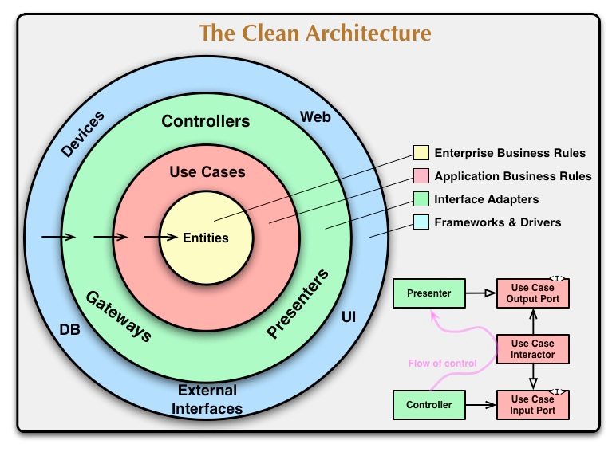

# Folder Concepts
The microservice is implemented according to the principle of the basic architecture (Clean Architecture)

## Clean Architecture
Clean Architecture is a software design principle that promotes the separation of concerns and the independence of components in a system. 

It emphasizes the organization of code into distinct layers, with the innermost layer containing the core business logic and the outer layers providing frameworks, databases, or user interfaces. 

This approach allows for maintainability, testability, and flexibility, as changes in one layer do not affect others, enabling easier evolution and adaptation of the system over time.

## Folder Structure

Here's a breakdown of the folder names and their explanations within the context of these design patterns:

`./application/`:
This folder contains the application itself providing configuration files and dependency injection.

`./persistence/`:
The persistence folder is associated with the infrastructure layer, specifically the implementation of data access and storage mechanisms. It may include repositories, data mappers, or other components related to database access and persistence.

`./usecase/`:
The usecase folder is often used to organize the different use cases of the application. This folder is likely the root or parent folder for all the use cases in the application. It serves as a way to organize and group related use cases.

`./usecase/scenarios/`:
Within the usecase folder, the <domain> subfolder indicates that it contains use cases specifically related to <domain>-related functionality. The scenarios folder suggests that it may include different scenarios or variations of the <domain> use case, possibly representing different ways of handling <domain>-related operations.

`./domain/`:
The domain folder is typically associated with the domain layer, which represents the core business logic and entities of the application. It often includes domain models, aggregate roots, value objects, and other domain-specific components.

`./rest/` or `./controllers`:
The rest folder is to represent the presentation layer, particularly the RESTful API components. It may include controllers, serializers, or other components responsible for handling HTTP requests and responses in a RESTful manner.

It's worth noting that while the folder names align with common conventions in DDD and Clean Architecture, the exact folder structure and naming conventions can vary depending on the specific project's requirements and preferences.
